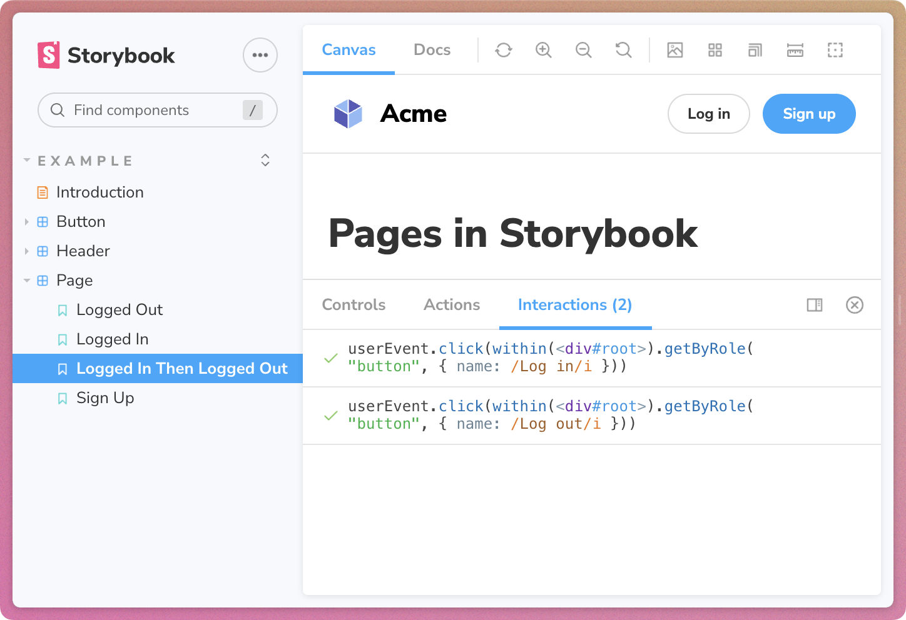
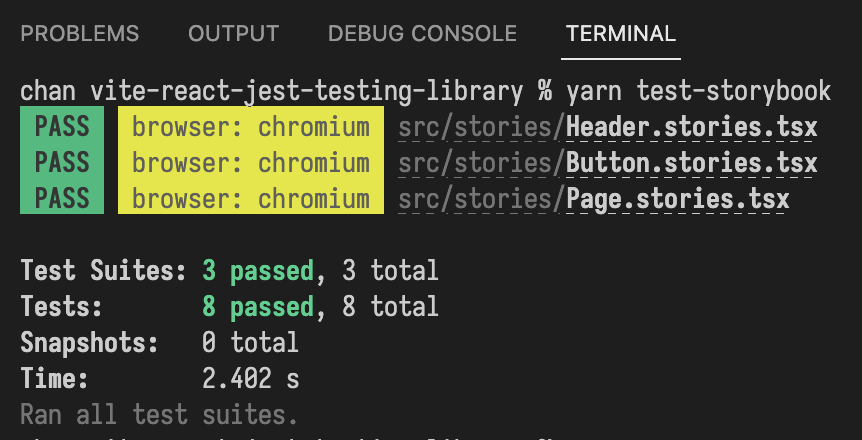
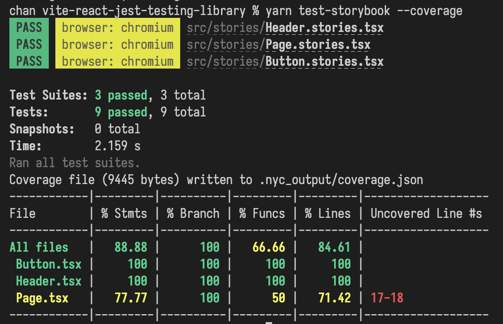
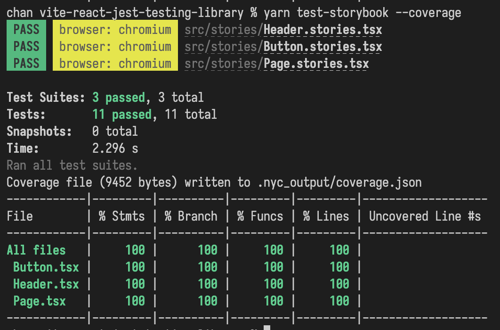
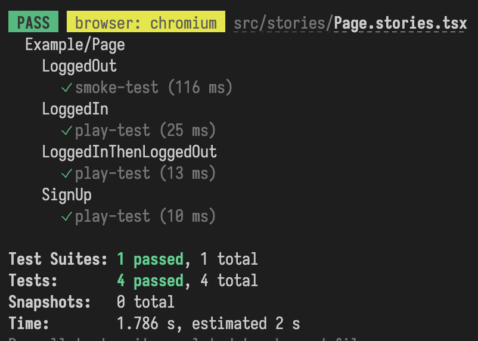
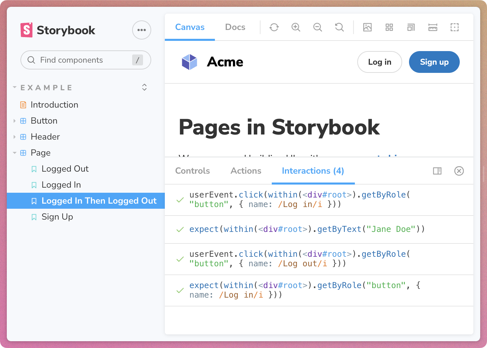
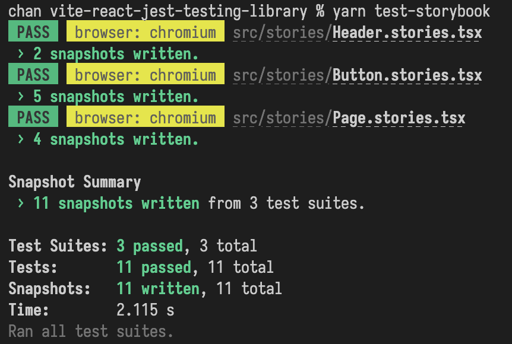
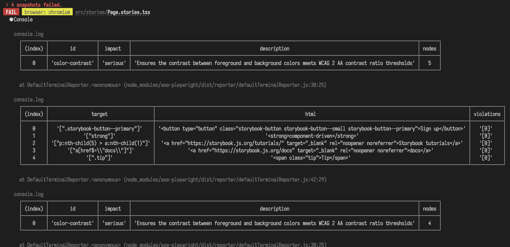
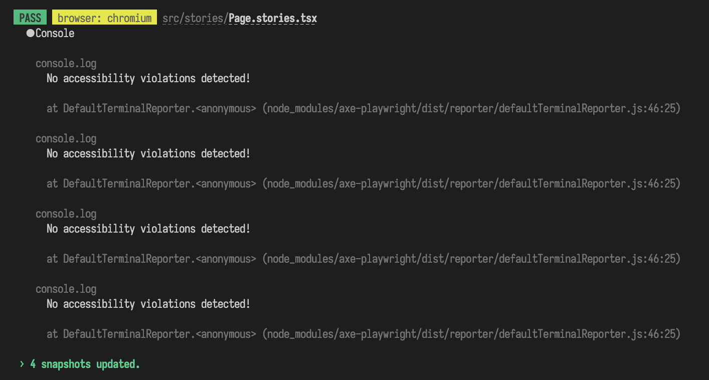

# Storybook demo using vite, react, jest, testing-library, and axe-playwright

## Storybook for component testing

I threw this together to demonstrate some modern Storybook approaches in [a Hacker News thread](https://news.ycombinator.com/item?id=33675261).

This repo demonstrates how the [`@storybook/test-runner`](https://storybook.js.org/addons/@storybook/test-runner) can be used as a bridge between [Storybook](https://storybook.js.org/) and [Jest](https://jestjs.io/). And provide an improved experiencing, using Storybook as a GUI for Jest + Testing Library.

To show a handful of things that we can get for free when using Stories as a component testing tool.



## Other modern Storybook notes

### Storybook on esbuild/vite

I used [Storybook's Vite builder](https://storybook.js.org/blog/storybook-for-vite/) in response to other comments.

### Modern Component Story Format 3 syntax

I updated the sample stories to use [CSF 3](https://storybook.js.org/blog/component-story-format-3-0/), the latest Component Story Format syntax for documenting stories. [Ladle](https://ladle.dev/) also uses Component Story Format for component documentation.

I find it a terse, readable (ES Modules), and composable way to write story-driven tests and documentation.

## Reproduction steps

:info: Note: each section heading is a link to the corresponding commit.

### [Add @storybook/test-runner for automatic just smoke-tests](https://github.com/chantastic/vite-react-jest-testing-library-axe/commit/8342601f1c0eae0f64334e893cfa4d6a7f85c111)

- `yarn add -D @storybook/test-runner`
- add script `"test-storybook": "test-storybook"`



### [Add @storybook/addon-coverage for istanbul cov report](https://github.com/chantastic/vite-react-jest-testing-library-axe/commit/a57ce3d1d8b0bef7ba623de73de5e43d310def79)

- `yarn add -D @storybook/addon-coverage`
- Register addon in `.storybook/main.js`

```diff
// main.js

module.exports = {
  // ...
  "addons": [
    // ...
+   "@storybook/addon-coverage"
  ],
  // ...
}
```



### [Improve Button test coverage to 100%](https://github.com/chantastic/vite-react-jest-testing-library-axe/commit/e67777341a9ef7dc154cc2fc0406da569fa8d6f6)

- Add new `Button.stories.tsx` story to cover `backgroundColor` prop code path

### [Improve Page test coverage to 100%](https://github.com/chantastic/vite-react-jest-testing-library-axe/commit/5e38ef2d26485e0928930e04db9c06e79bae562a)

- Add new `Page.stories.tsx` stories to cover interactive states.
  - Use [Storybook play functions](https://storybook.js.org/docs/react/writing-stories/play-function) to interact with stories using [testing-library](https://testing-library.com/).
- Cover `LoggedInThenLoggedOut` interaction
- Cover `Sign up` interaction


```tsx
// Page.stories.tsx

// ...

export const LoggedInThenLoggedOut = Template.bind({});
LoggedInThenLoggedOut.play = async (context) => {
  await LoggedIn.play(context);
  const canvas = within(context.canvasElement);
  const logoutButton = await canvas.getByRole("button", {
    name: /Log out/i,
  });
  await userEvent.click(logoutButton);
};

export const SignUp = Template.bind({});
SignUp.play = async ({ canvasElement }) => {
  const canvas = within(canvasElement);
  const signUpButton = await canvas.getByRole("button", {
    name: /Sign up/i,
  });
  await userEvent.click(signUpButton);
};
```



### [Update all stories to tidier CSF 3 syntax](https://github.com/chantastic/vite-react-jest-testing-library-axe/commit/74e5d569355a27bad4b16c9659a6018bce3126b5)

---

- Update all stories to [CSF3 syntax](https://storybook.js.org/blog/component-story-format-3-0/)

```diff
// example
- const Template: ComponentStory<typeof Button> = (args) => <Button {...args} />;
-
- export const Primary = Template.bind({});
- Primary.args = {
-   primary: true,
-   label: 'Button',
- }
+ export const Primary = {
+   args: {
+     primary: true,
+     label: "Button",
+  }
+ }

```

### [Add @storybook/jest assertions](https://github.com/chantastic/vite-react-jest-testing-library-axe/commit/686df235e8042e8aef839767b2137d71131447a8)

- Add `@storybook/jest`
- Add assertions directly to interactive `Page.stories.tsx` stories

```diff
+ expect(await canvas.getByText("Jane Doe"));
```






### [Add toMatchSnapshot() expectation to all stories](https://github.com/chantastic/vite-react-jest-testing-library-axe/commit/26c03a09e3d64af9c2078894e501a363a6d1c8d0)

- Add `.storybook/test-runner.cjs` config to use the test-runner's [test hook API](https://storybook.js.org/addons/@storybook/test-runner#render-lifecycle:~:text=.-,Experimental%20test%20hook%20API,-The%20test%20runner)
- Add an automatic [Jest snapshot](https://jestjs.io/docs/snapshot-testing) for every story.

```cjs
// .storybook/test-runner.js
module.exports = {
  async postRender(page) {
    const elementHandler = await page.$("#root");
    const innerHTML = await elementHandler.innerHTML();
    expect(innerHTML).toMatchSnapshot();
  },
};
```



### [Add automated accessibility tests and a11y tree snapshot tests](https://github.com/chantastic/vite-react-jest-testing-library-axe/commit/f29c384479c73d5495e31c405e657be06ff278fc)
- `yarn add -D axe-playwright`
- `npx playwright install --with-deps` (to setup the machine's playright environment)
- Add `.storybook/test-runner` config to automate accessibility tests for every story

```cjs
const { injectAxe, checkA11y } = require("axe-playwright");

module.exports = {
  async preRender(page) {
    await injectAxe(page);
  },
  async postRender(page) {
    await checkA11y(page, "#root", {
      detailedReport: true,
      detailedReportOptions: {
        html: true,
      },
    });

    const accessibilityTree =
      await page.accessibility.snapshot();
    expect(accessibilityTree).toMatchSnapshot();

    // ...
  },
};
```



### [Fix all accessibility violations and update snapshots for green lights](https://github.com/chantastic/vite-react-jest-testing-library-axe/commit/b6baa4c8676a188a14050a636e90f6452174c47b)


